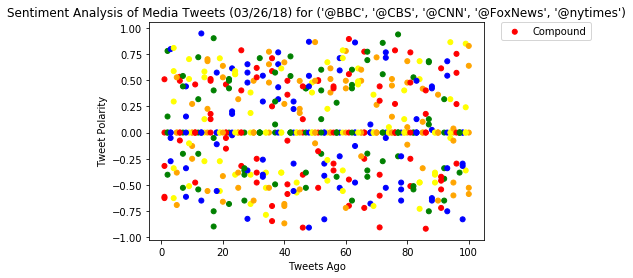
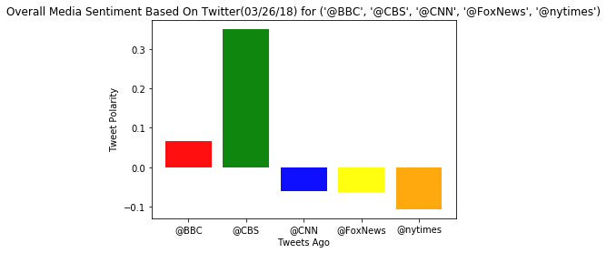

```python
# Dependencies
import tweepy
import json
import numpy as np
import pandas as pd
import matplotlib.pyplot as plt
import seaborn as sns
import time

# Import and Initialize Sentiment Analyzer
from vaderSentiment.vaderSentiment import SentimentIntensityAnalyzer
analyzer = SentimentIntensityAnalyzer()

# Twitter API Keys
consumer_key=""
consumer_secret=""
access_token=""
access_token_secret=""

# Setup Tweepy API Authentication
auth = tweepy.OAuthHandler(consumer_key, consumer_secret)
auth.set_access_token(access_token, access_token_secret)
api = tweepy.API(auth,parser=tweepy.parsers.JSONParser())

```


```python
target_user = ("@BBC", "@CBS","@CNN", "@FoxNews" ,"@nytimes")
df=pd.DataFrame()
sentiments = []
compound_mean=[]
for user in target_user:
    counter = 1

#     # Variables for holding sentiments
#     compound_list = []
#     positive_list = []
#     negative_list = []
#     neutral_list = []
    


    # Get all tweets from home feed
    public_tweets = api.user_timeline(user, count=100)

    # Loop through all tweets 
    for tweet in public_tweets:

        # Run Vader Analysis on each tweet
        polarity_score = analyzer.polarity_scores(tweet["text"])
        compound = polarity_score["compound"]
        pos = polarity_score["pos"]
        neu = polarity_score["neu"]
        neg = polarity_score["neg"]
         # Add sentiments for each tweet into an array
        sentiments.append({"Date": tweet["created_at"], 
                           "Compound": compound,
                           "Positive": pos,
                           "Negative": neu,
                           "Neutral": neg,
                           "Tweets Ago": counter,
                           "User" : user})
#         compound_list.append(compound)

#         compound_mean.append({"Coumpound_avg":np.mean(compound_list)})

        counter=counter+1
    
#     Convert sentiments to DataFrame
sentiments_pd = pd.DataFrame.from_dict(sentiments)
sentiments_pd
# compound_pd = pd.DataFrame.from_dict(compound_mean)
# compound_pd

   
            
```


<div>
<style>
    .dataframe thead tr:only-child th {
        text-align: right;
    }

    .dataframe thead th {
        text-align: left;
    }

    .dataframe tbody tr th {
        vertical-align: top;
    }
</style>
<table border="1" class="dataframe">
  <thead>
    <tr style="text-align: right;">
      <th></th>
      <th>Compound</th>
      <th>Date</th>
      <th>Negative</th>
      <th>Neutral</th>
      <th>Positive</th>
      <th>Tweets Ago</th>
      <th>User</th>
    </tr>
  </thead>
  <tbody>
    <tr>
      <th>0</th>
      <td>-0.6249</td>
      <td>Mon Mar 26 19:03:02 +0000 2018</td>
      <td>0.806</td>
      <td>0.194</td>
      <td>0.000</td>
      <td>1</td>
      <td>@BBC</td>
    </tr>
    <tr>
      <th>1</th>
      <td>0.7783</td>
      <td>Mon Mar 26 18:24:04 +0000 2018</td>
      <td>0.688</td>
      <td>0.000</td>
      <td>0.312</td>
      <td>2</td>
      <td>@BBC</td>
    </tr>
    <tr>
      <th>2</th>
      <td>0.0000</td>
      <td>Mon Mar 26 17:30:04 +0000 2018</td>
      <td>1.000</td>
      <td>0.000</td>
      <td>0.000</td>
      <td>3</td>
      <td>@BBC</td>
    </tr>
    <tr>
      <th>3</th>
      <td>0.5859</td>
      <td>Mon Mar 26 16:25:02 +0000 2018</td>
      <td>0.787</td>
      <td>0.000</td>
      <td>0.213</td>
      <td>4</td>
      <td>@BBC</td>
    </tr>
    <tr>
      <th>4</th>
      <td>-0.3818</td>
      <td>Mon Mar 26 15:45:04 +0000 2018</td>
      <td>0.744</td>
      <td>0.161</td>
      <td>0.095</td>
      <td>5</td>
      <td>@BBC</td>
    </tr>
    <tr>
      <th>5</th>
      <td>0.0000</td>
      <td>Mon Mar 26 15:11:57 +0000 2018</td>
      <td>1.000</td>
      <td>0.000</td>
      <td>0.000</td>
      <td>6</td>
      <td>@BBC</td>
    </tr>
    <tr>
      <th>6</th>
      <td>0.0000</td>
      <td>Mon Mar 26 12:58:02 +0000 2018</td>
      <td>1.000</td>
      <td>0.000</td>
      <td>0.000</td>
      <td>7</td>
      <td>@BBC</td>
    </tr>
    <tr>
      <th>7</th>
      <td>0.4404</td>
      <td>Mon Mar 26 11:48:03 +0000 2018</td>
      <td>0.828</td>
      <td>0.000</td>
      <td>0.172</td>
      <td>8</td>
      <td>@BBC</td>
    </tr>
    <tr>
      <th>8</th>
      <td>-0.5106</td>
      <td>Mon Mar 26 11:00:05 +0000 2018</td>
      <td>0.837</td>
      <td>0.163</td>
      <td>0.000</td>
      <td>9</td>
      <td>@BBC</td>
    </tr>
    <tr>
      <th>9</th>
      <td>-0.1280</td>
      <td>Mon Mar 26 10:00:07 +0000 2018</td>
      <td>0.930</td>
      <td>0.070</td>
      <td>0.000</td>
      <td>10</td>
      <td>@BBC</td>
    </tr>
    <tr>
      <th>10</th>
      <td>0.4588</td>
      <td>Mon Mar 26 09:35:06 +0000 2018</td>
      <td>0.864</td>
      <td>0.000</td>
      <td>0.136</td>
      <td>11</td>
      <td>@BBC</td>
    </tr>
    <tr>
      <th>11</th>
      <td>0.3182</td>
      <td>Mon Mar 26 09:33:01 +0000 2018</td>
      <td>0.753</td>
      <td>0.000</td>
      <td>0.247</td>
      <td>12</td>
      <td>@BBC</td>
    </tr>
    <tr>
      <th>12</th>
      <td>0.0000</td>
      <td>Mon Mar 26 09:04:01 +0000 2018</td>
      <td>1.000</td>
      <td>0.000</td>
      <td>0.000</td>
      <td>13</td>
      <td>@BBC</td>
    </tr>
    <tr>
      <th>13</th>
      <td>0.5819</td>
      <td>Mon Mar 26 08:29:04 +0000 2018</td>
      <td>0.818</td>
      <td>0.000</td>
      <td>0.182</td>
      <td>14</td>
      <td>@BBC</td>
    </tr>
    <tr>
      <th>14</th>
      <td>0.2263</td>
      <td>Mon Mar 26 07:30:10 +0000 2018</td>
      <td>0.749</td>
      <td>0.090</td>
      <td>0.161</td>
      <td>15</td>
      <td>@BBC</td>
    </tr>
    <tr>
      <th>15</th>
      <td>0.1280</td>
      <td>Sun Mar 25 19:44:01 +0000 2018</td>
      <td>0.821</td>
      <td>0.077</td>
      <td>0.101</td>
      <td>16</td>
      <td>@BBC</td>
    </tr>
    <tr>
      <th>16</th>
      <td>-0.7506</td>
      <td>Sun Mar 25 19:15:06 +0000 2018</td>
      <td>0.714</td>
      <td>0.286</td>
      <td>0.000</td>
      <td>17</td>
      <td>@BBC</td>
    </tr>
    <tr>
      <th>17</th>
      <td>0.5719</td>
      <td>Sun Mar 25 18:40:04 +0000 2018</td>
      <td>0.837</td>
      <td>0.000</td>
      <td>0.163</td>
      <td>18</td>
      <td>@BBC</td>
    </tr>
    <tr>
      <th>18</th>
      <td>0.0000</td>
      <td>Sun Mar 25 18:13:03 +0000 2018</td>
      <td>1.000</td>
      <td>0.000</td>
      <td>0.000</td>
      <td>19</td>
      <td>@BBC</td>
    </tr>
    <tr>
      <th>19</th>
      <td>0.5267</td>
      <td>Sun Mar 25 17:30:07 +0000 2018</td>
      <td>0.815</td>
      <td>0.000</td>
      <td>0.185</td>
      <td>20</td>
      <td>@BBC</td>
    </tr>
    <tr>
      <th>20</th>
      <td>0.4588</td>
      <td>Sun Mar 25 15:03:03 +0000 2018</td>
      <td>0.833</td>
      <td>0.000</td>
      <td>0.167</td>
      <td>21</td>
      <td>@BBC</td>
    </tr>
    <tr>
      <th>21</th>
      <td>0.0000</td>
      <td>Sun Mar 25 14:30:02 +0000 2018</td>
      <td>1.000</td>
      <td>0.000</td>
      <td>0.000</td>
      <td>22</td>
      <td>@BBC</td>
    </tr>
    <tr>
      <th>22</th>
      <td>0.1779</td>
      <td>Sun Mar 25 14:09:03 +0000 2018</td>
      <td>0.909</td>
      <td>0.000</td>
      <td>0.091</td>
      <td>23</td>
      <td>@BBC</td>
    </tr>
    <tr>
      <th>23</th>
      <td>0.5574</td>
      <td>Sun Mar 25 13:03:04 +0000 2018</td>
      <td>0.816</td>
      <td>0.000</td>
      <td>0.184</td>
      <td>24</td>
      <td>@BBC</td>
    </tr>
    <tr>
      <th>24</th>
      <td>0.0000</td>
      <td>Sun Mar 25 12:03:02 +0000 2018</td>
      <td>1.000</td>
      <td>0.000</td>
      <td>0.000</td>
      <td>25</td>
      <td>@BBC</td>
    </tr>
    <tr>
      <th>25</th>
      <td>0.0000</td>
      <td>Sun Mar 25 10:30:04 +0000 2018</td>
      <td>1.000</td>
      <td>0.000</td>
      <td>0.000</td>
      <td>26</td>
      <td>@BBC</td>
    </tr>
    <tr>
      <th>26</th>
      <td>-0.3612</td>
      <td>Sun Mar 25 09:30:15 +0000 2018</td>
      <td>0.839</td>
      <td>0.161</td>
      <td>0.000</td>
      <td>27</td>
      <td>@BBC</td>
    </tr>
    <tr>
      <th>27</th>
      <td>0.5719</td>
      <td>Sun Mar 25 08:43:31 +0000 2018</td>
      <td>0.764</td>
      <td>0.000</td>
      <td>0.236</td>
      <td>28</td>
      <td>@BBC</td>
    </tr>
    <tr>
      <th>28</th>
      <td>-0.4019</td>
      <td>Sun Mar 25 08:43:26 +0000 2018</td>
      <td>0.899</td>
      <td>0.101</td>
      <td>0.000</td>
      <td>29</td>
      <td>@BBC</td>
    </tr>
    <tr>
      <th>29</th>
      <td>0.0000</td>
      <td>Sun Mar 25 08:43:22 +0000 2018</td>
      <td>1.000</td>
      <td>0.000</td>
      <td>0.000</td>
      <td>30</td>
      <td>@BBC</td>
    </tr>
    <tr>
      <th>...</th>
      <td>...</td>
      <td>...</td>
      <td>...</td>
      <td>...</td>
      <td>...</td>
      <td>...</td>
      <td>...</td>
    </tr>
    <tr>
      <th>470</th>
      <td>0.3034</td>
      <td>Mon Mar 26 12:49:04 +0000 2018</td>
      <td>0.895</td>
      <td>0.000</td>
      <td>0.105</td>
      <td>71</td>
      <td>@nytimes</td>
    </tr>
    <tr>
      <th>471</th>
      <td>0.0000</td>
      <td>Mon Mar 26 12:46:06 +0000 2018</td>
      <td>1.000</td>
      <td>0.000</td>
      <td>0.000</td>
      <td>72</td>
      <td>@nytimes</td>
    </tr>
    <tr>
      <th>472</th>
      <td>-0.0516</td>
      <td>Mon Mar 26 12:28:01 +0000 2018</td>
      <td>0.938</td>
      <td>0.062</td>
      <td>0.000</td>
      <td>73</td>
      <td>@nytimes</td>
    </tr>
    <tr>
      <th>473</th>
      <td>0.0516</td>
      <td>Mon Mar 26 12:16:02 +0000 2018</td>
      <td>0.800</td>
      <td>0.096</td>
      <td>0.104</td>
      <td>74</td>
      <td>@nytimes</td>
    </tr>
    <tr>
      <th>474</th>
      <td>0.0000</td>
      <td>Mon Mar 26 12:00:02 +0000 2018</td>
      <td>1.000</td>
      <td>0.000</td>
      <td>0.000</td>
      <td>75</td>
      <td>@nytimes</td>
    </tr>
    <tr>
      <th>475</th>
      <td>0.0000</td>
      <td>Mon Mar 26 11:40:04 +0000 2018</td>
      <td>1.000</td>
      <td>0.000</td>
      <td>0.000</td>
      <td>76</td>
      <td>@nytimes</td>
    </tr>
    <tr>
      <th>476</th>
      <td>0.0000</td>
      <td>Mon Mar 26 11:30:05 +0000 2018</td>
      <td>1.000</td>
      <td>0.000</td>
      <td>0.000</td>
      <td>77</td>
      <td>@nytimes</td>
    </tr>
    <tr>
      <th>477</th>
      <td>-0.2263</td>
      <td>Mon Mar 26 11:15:05 +0000 2018</td>
      <td>0.779</td>
      <td>0.130</td>
      <td>0.091</td>
      <td>78</td>
      <td>@nytimes</td>
    </tr>
    <tr>
      <th>478</th>
      <td>0.1280</td>
      <td>Mon Mar 26 11:00:13 +0000 2018</td>
      <td>0.914</td>
      <td>0.000</td>
      <td>0.086</td>
      <td>79</td>
      <td>@nytimes</td>
    </tr>
    <tr>
      <th>479</th>
      <td>-0.1154</td>
      <td>Mon Mar 26 10:51:03 +0000 2018</td>
      <td>0.932</td>
      <td>0.068</td>
      <td>0.000</td>
      <td>80</td>
      <td>@nytimes</td>
    </tr>
    <tr>
      <th>480</th>
      <td>0.0000</td>
      <td>Mon Mar 26 10:40:08 +0000 2018</td>
      <td>1.000</td>
      <td>0.000</td>
      <td>0.000</td>
      <td>81</td>
      <td>@nytimes</td>
    </tr>
    <tr>
      <th>481</th>
      <td>-0.5106</td>
      <td>Mon Mar 26 10:30:07 +0000 2018</td>
      <td>0.711</td>
      <td>0.213</td>
      <td>0.075</td>
      <td>82</td>
      <td>@nytimes</td>
    </tr>
    <tr>
      <th>482</th>
      <td>0.0000</td>
      <td>Mon Mar 26 10:00:14 +0000 2018</td>
      <td>1.000</td>
      <td>0.000</td>
      <td>0.000</td>
      <td>83</td>
      <td>@nytimes</td>
    </tr>
    <tr>
      <th>483</th>
      <td>-0.7269</td>
      <td>Mon Mar 26 10:00:12 +0000 2018</td>
      <td>0.638</td>
      <td>0.289</td>
      <td>0.072</td>
      <td>84</td>
      <td>@nytimes</td>
    </tr>
    <tr>
      <th>484</th>
      <td>0.1027</td>
      <td>Mon Mar 26 09:45:03 +0000 2018</td>
      <td>0.655</td>
      <td>0.148</td>
      <td>0.197</td>
      <td>85</td>
      <td>@nytimes</td>
    </tr>
    <tr>
      <th>485</th>
      <td>0.0000</td>
      <td>Mon Mar 26 09:30:10 +0000 2018</td>
      <td>1.000</td>
      <td>0.000</td>
      <td>0.000</td>
      <td>86</td>
      <td>@nytimes</td>
    </tr>
    <tr>
      <th>486</th>
      <td>0.1280</td>
      <td>Mon Mar 26 09:15:08 +0000 2018</td>
      <td>0.753</td>
      <td>0.113</td>
      <td>0.134</td>
      <td>87</td>
      <td>@nytimes</td>
    </tr>
    <tr>
      <th>487</th>
      <td>-0.6486</td>
      <td>Mon Mar 26 09:00:07 +0000 2018</td>
      <td>0.815</td>
      <td>0.185</td>
      <td>0.000</td>
      <td>88</td>
      <td>@nytimes</td>
    </tr>
    <tr>
      <th>488</th>
      <td>0.0000</td>
      <td>Mon Mar 26 08:45:08 +0000 2018</td>
      <td>1.000</td>
      <td>0.000</td>
      <td>0.000</td>
      <td>89</td>
      <td>@nytimes</td>
    </tr>
    <tr>
      <th>489</th>
      <td>0.0000</td>
      <td>Mon Mar 26 08:30:12 +0000 2018</td>
      <td>1.000</td>
      <td>0.000</td>
      <td>0.000</td>
      <td>90</td>
      <td>@nytimes</td>
    </tr>
    <tr>
      <th>490</th>
      <td>-0.4588</td>
      <td>Mon Mar 26 08:15:04 +0000 2018</td>
      <td>0.875</td>
      <td>0.125</td>
      <td>0.000</td>
      <td>91</td>
      <td>@nytimes</td>
    </tr>
    <tr>
      <th>491</th>
      <td>-0.6486</td>
      <td>Mon Mar 26 08:00:06 +0000 2018</td>
      <td>0.717</td>
      <td>0.283</td>
      <td>0.000</td>
      <td>92</td>
      <td>@nytimes</td>
    </tr>
    <tr>
      <th>492</th>
      <td>-0.3400</td>
      <td>Mon Mar 26 07:46:02 +0000 2018</td>
      <td>0.882</td>
      <td>0.118</td>
      <td>0.000</td>
      <td>93</td>
      <td>@nytimes</td>
    </tr>
    <tr>
      <th>493</th>
      <td>0.3182</td>
      <td>Mon Mar 26 07:18:37 +0000 2018</td>
      <td>0.901</td>
      <td>0.000</td>
      <td>0.099</td>
      <td>94</td>
      <td>@nytimes</td>
    </tr>
    <tr>
      <th>494</th>
      <td>-0.0772</td>
      <td>Mon Mar 26 07:08:33 +0000 2018</td>
      <td>0.400</td>
      <td>0.320</td>
      <td>0.280</td>
      <td>95</td>
      <td>@nytimes</td>
    </tr>
    <tr>
      <th>495</th>
      <td>0.0000</td>
      <td>Mon Mar 26 06:52:38 +0000 2018</td>
      <td>1.000</td>
      <td>0.000</td>
      <td>0.000</td>
      <td>96</td>
      <td>@nytimes</td>
    </tr>
    <tr>
      <th>496</th>
      <td>0.0000</td>
      <td>Mon Mar 26 06:38:27 +0000 2018</td>
      <td>1.000</td>
      <td>0.000</td>
      <td>0.000</td>
      <td>97</td>
      <td>@nytimes</td>
    </tr>
    <tr>
      <th>497</th>
      <td>-0.8271</td>
      <td>Mon Mar 26 06:22:10 +0000 2018</td>
      <td>0.697</td>
      <td>0.303</td>
      <td>0.000</td>
      <td>98</td>
      <td>@nytimes</td>
    </tr>
    <tr>
      <th>498</th>
      <td>0.0000</td>
      <td>Mon Mar 26 06:07:01 +0000 2018</td>
      <td>1.000</td>
      <td>0.000</td>
      <td>0.000</td>
      <td>99</td>
      <td>@nytimes</td>
    </tr>
    <tr>
      <th>499</th>
      <td>0.6369</td>
      <td>Mon Mar 26 05:47:31 +0000 2018</td>
      <td>0.781</td>
      <td>0.000</td>
      <td>0.219</td>
      <td>100</td>
      <td>@nytimes</td>
    </tr>
  </tbody>
</table>
<p>500 rows × 7 columns</p>
</div>


```python
# Create plot
colors = ( "red", "green", "blue", "yellow", "orange")

plt.scatter(sentiments_pd["Tweets Ago"],
            sentiments_pd["Compound"], 
            s = 25, c = colors)

# # Incorporate the other graph properties
plt.title("Sentiment Analysis of Media Tweets (%s) for %s" % (time.strftime("%x"),target_user))
plt.ylabel("Tweet Polarity")
plt.xlabel("Tweets Ago")
plt.legend(bbox_to_anchor=(1.05, 1), loc=2, borderaxespad=0.)
plt.show()
```





```python
Compound_avgs=[]
for user in target_user:
    df = sentiments_pd.loc[sentiments_pd["User"] == user]
    Compound_avgs.append(df["Compound"].mean())
Compound_avgs
```


    [0.06572099999999999,
     0.3497249999999999,
     -0.05970699999999999,
     -0.063838,
     -0.106507]


```python
plt.bar(target_user, Compound_avgs , color= colors , alpha=0.5)
plt.title("Overall Media Sentiment Based On Twitter(%s) for %s" % (time.strftime("%x"),target_user))
plt.ylabel("Tweet Polarity")
plt.xlabel("Tweets Ago")
plt.show()
```




